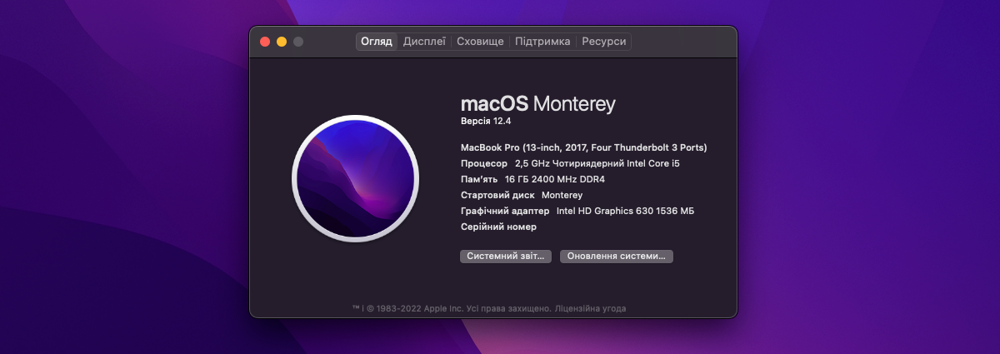

# MacOS for Asus FX553V

## Hardware
* CPU
  * i5 7300HQ Kaby Lake
* GPU
  * Intel HD630 1.5Gb
  * Nvidia GTX 1050Ti 4Gb ( <b>NOT</b> work )
* RAM
  * 2 x 8GB Samsung 2400Mh
* ROM
  * Netac NVMe SSD 250GB
* Audio
  * Realteck ALC235
* WiFi / Bluetooth
  * Intel AC7265 DualBan

## OS

* MacOS 11.1 Big Sur [ OpenCore 0.6.5 ]

## Result

<table>
  <thead>
    <tr>
      <th>Device</th>
      <th>Name</th>
      <th>Working</th>
    </tr>
  </thead>
  <tbody>
    <tr>
      <td>Processor</td>
      <td>Intel® Core™ i5 7300HQ Processor</td>
      <td>YES</td>
    </tr>
    <tr>
      <td>Chipset</td>
      <td>Intel® C230 Chipset</td> 
      <td>YES</td>
    </tr>
    <tr>
      <td>Memory</td>
      <td>16 GB SDRAM, 2 x SO-DIMM socket DDR4 2400 MHz</td>
      <td>YES</td>
    </tr>
    <tr>
      <td>Graphic</td>
      <td>INTEL HD 630 1.5Gb</td>
      <td>YES</td>
    </tr>
    <tr>
      <td>Graphic</td>
      <td>NVIDIA GeForce GTX 1050Ti 4Gb</td>
      <td><strong>NO</strong></td>
    </tr>
    <tr>
      <td>Audio</td>
      <td>ALC233(235)</td>
      <td>YES</td>
    </tr>
    <tr>
      <td>Storage</td>
      <td>SSD SATA3, PCIE Gen3X4 SSD, Hard Drives</td>
      <td>YES</td>
    </tr>
    <tr>
      <td>Keyboard</td>
      <td>ASUS onboard</td>
      <td>Yes</td>
    </tr>
    <tr>
      <td>Card Reader</td>
      <td>RTS5229 PCI Express</td>
      <td>Testing</td>
    </tr>
    <tr>
      <td>WebCam</td>
      <td>ASUS onboard HD UVC</td>
      <td>YES</td>
    </tr>
    <tr>
      <td>Networking</td>
      <td>Realtek RTL8168H/8111H PCI Express Gigabit Ethernet</td>
      <td>YES</td>
    </tr>
    <tr>
      <td>Wifi</td>
      <td>Intel AC7265</td>
      <td>YES (with <a target="_blank" href="https://github.com/OpenIntelWireless/HeliPort/releases">HeliPort</a> GUI)</td>
    </tr>
    <tr>
      <td>Bluetooth</td>
      <td>Intel AC7265</td>
      <td>YES</td>
    </tr>
    <tr>
      <td>Battery</td>
      <td>4 Cells Battery 3350mAh</td>
      <td>YES</td>
    </tr>
    <tr>
      <td>USB</td>
      <td>USB 3.0 Bus</td>
      <td>Testing</td>
    </tr>
    <tr>
      <td>HDMI</td>
      <td>INTEL HDMI HD 630</td>
      <td>YES (no audio)</td>
    </tr>
    <tr>
      <td>Touchpad</td>
      <td>ELAN 1200</td>
      <td>YES</td>
    </tr>
  </tbody>
</table>